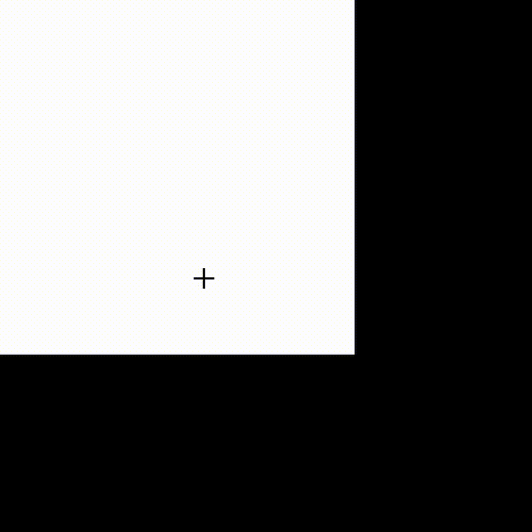
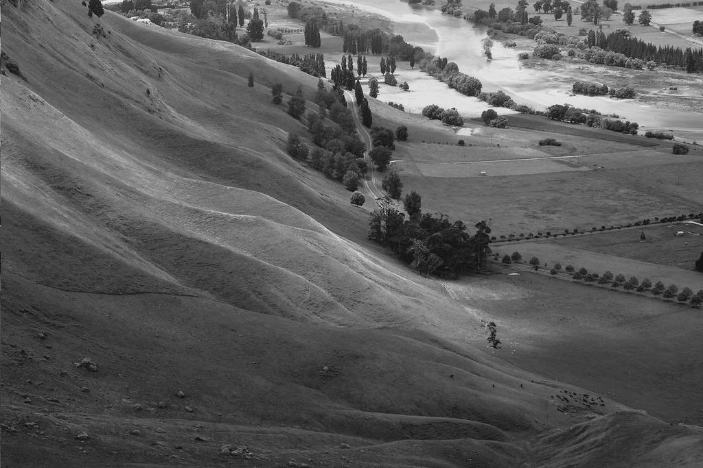
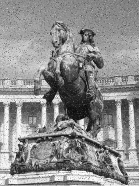
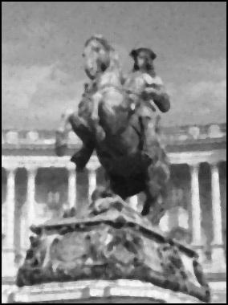
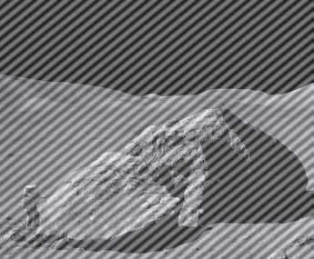
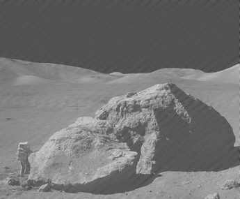
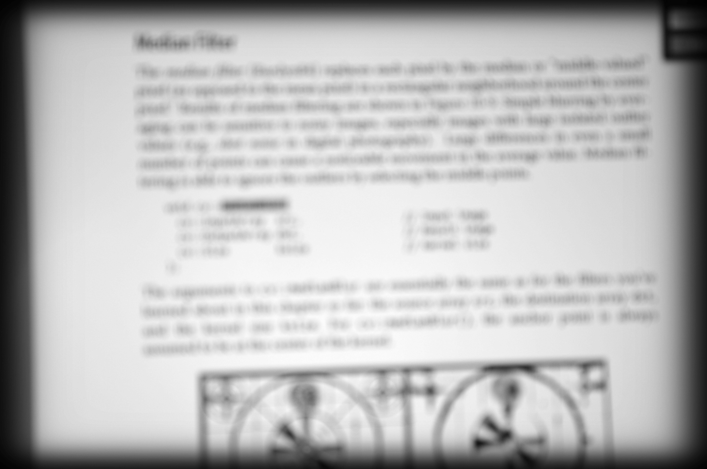
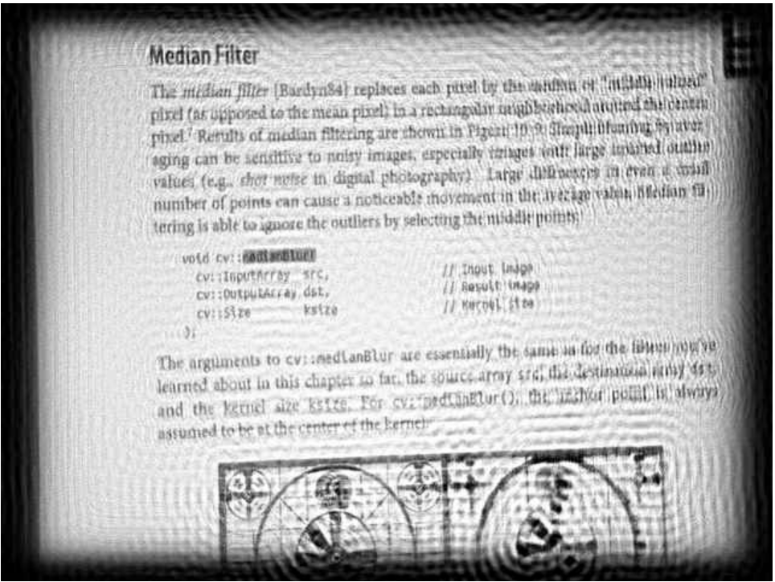

# Computer-vision
## Introduction
Here is my python source code for coding computer vision using sever technique to handle noise images.

#### The first 
Drawing a rectangle after that scaling, rotation and translation.

  
  
  
  

#### The second
Fixing low constrast image.

  
  

#### The third
Using median filter and mean filter to remove salt and pepper iamges

  
  
  

#### The fourth
Removing stripes in images that are affected by magnetism

  
  

#### The fifth
Handing blur images which are very diffcult for people to see the images.

  
  

